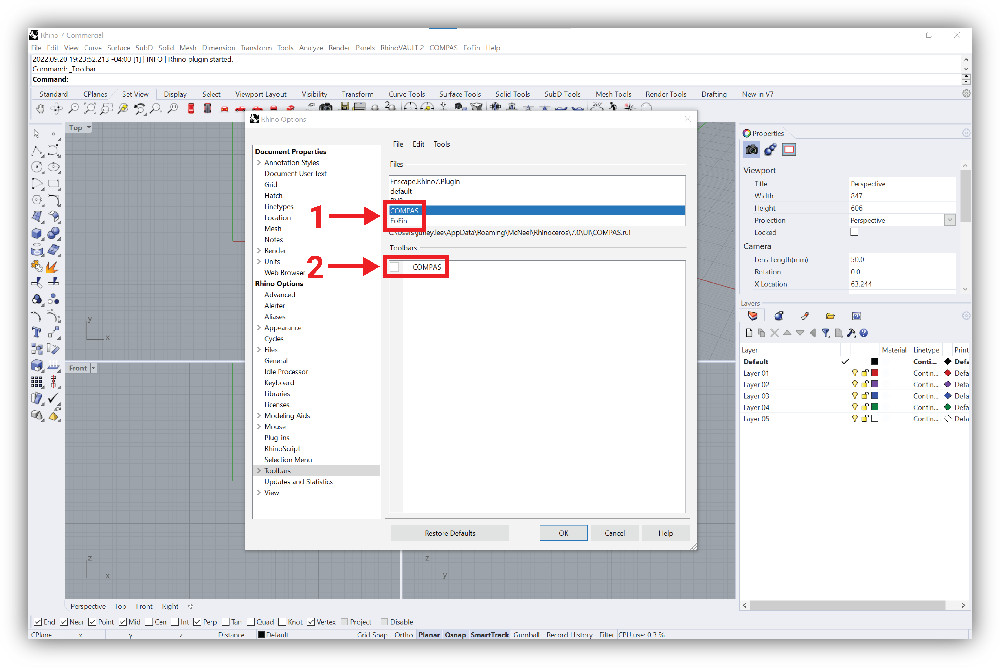

# Quick install

## Anaconda 3


If you are sure you already have Anaconda installed in your computer, you can skip the first step.


### 1. Download the Anaconda installer

The Installation of Anaconda can be done through the link below. The installation is free and **does not require any** registration. Note the installer download starts once you click in the `Download` button in green.



<figure><figcaption></figcaption></figure>

### 2. Installing on Windows

You can follow the steps in the link below to install Anaconda on Windows.




#### Troubleshooting for usernames with spaces '\_'

If your username contains white spaces `' '` or special characters `éáã'ç` you will see the following warning that **should not be ignored**. Multiple python packages have trouble running into usernames with spaces. To avoid that, we will install Anaconda in a different location.


<figure><figcaption></figcaption></figure>


If you saw that warning, please create a folder named `anaconda3` within your local drive `C:\` the final address should look like this in the following image. After that, please accept all the default settings.


<figure><figcaption></figcaption></figure>

### 3. Installing on macOS

You can follow the steps in the link below to install Anaconda on macOS.



## IGS2


To install the plug-in for Algebraic GS, please make sure that you have installed [Anaconda 3](broken-reference).


### 1. Preparation

If you have a fresh installation of Rhino, or if you have never used it for scripting with Python, please open the software and launch the Python Script Editor. This will create a bunch of folders that are otherwise not yet available and are needed for the installation process of COMPAS in Rhino. You can launch the Python Script Editor in Rhino by typing the command `EditPythonScript` in the Rhino command prompt or from the toolbar: `Tools > PythonScript > Edit`. You don't need to do anything else. Afterward, you can close Rhino again.

### 2. Installation

The installation process involves commands that have to be executed on the command line. **On Mac**, you can use the _**Terminal**_ app. **On Windows**, you need to use the _**Anaconda Prompt**_ instead of the standard _Command Prompt_. The Anaconda Prompt is automatically installed when you install Anaconda.

<figure><figcaption><p>Terminal app for Mac users</p></figcaption></figure>

<figure><figcaption><p>Anaconda prompt for Windows users</p></figcaption></figure>


Windows users may have to run the Anaconda Prompt "**as administrator**" to have sufficient permissions to execute all the commands successfully.


Now, you have to execute the following 3 commands **one after another**. To do that, copy the first command line in your Terminal / Anaconda Prompt and press `return/enter` .**This will take a few minutes to be executed so please be patient**. Once it finishes completely, execute the second command line. And, once the second is finished, execute the last one.

#### 1. Creating an Environment and Downloading the packages

Copy the command and press `return/enter`.

```
conda env create -f https://blockresearchgroup.github.io/compas-IGS2/environment.yml
```

If you see the following lines, the installation is successful.

<figure><figcaption></figcaption></figure>

#### 2. Activating the Environment

```
conda activate csd1
```

You will see that you jump from the (_base_) to your (_csd1_) environment.

<figure><figcaption></figcaption></figure>

#### 3. Installing the Plug-ins in Rhino


Close all the Rhino windows you have opened. If you are using **Rhino 7.0**, please execute the following command.


```
python -m compas_rhino.install -v 7.0 --clean
```

Alternatively, if you are using **Rhino 6.0**, please execute the following command.

```
python -m compas_rhino.install -v 6.0 --clean
```

If the plug-ins are installed correctly, you should see "Install completed" and no errors.

<figure><figcaption></figcaption></figure>

#### 4. Updating the Plug-ins


You only need to run this command when there's a new release of the plug-in.


```
conda env update -f https://blockresearchgroup.github.io/compas-IGS2/environment.yml
```

After updating is finished, repeat [3. Installing the Plug-ins in Rhino](quick-install.md#3.-installing-the-plug-ins-in-rhino).

### Loading the Toolbars

After installing, restart Rhino, and run the command `EditPythonScript` at the Rhino command prompt. This will make Rhino scan the Python plugin folders and make the functionality of COMPAS and IGS2 available. You only need to do this once, and there is no need to restart Rhino afterward.

Loading the toolbars of IGS2 is slightly different on Mac and on Windows.

#### Mac Users

On Mac, you can load the toolbars by running the commands `COMPAS__toolbar` \*\*\*\* and \*\*\*\* `IGS2__toolbar`. \*\*\*\* You should now see the following toolbars in your Rhino viewport. You will have to do this every time you start Rhino.

<figure><figcaption></figcaption></figure>

#### Windows Users

On Windows, you only have to load the toolbars once and they will automatically appear every time Rhino starts.

In the top menu, go to `Tools > Toolbar Layout`. Go to `File > Open`. Select the file `COMPAS.rui` and click `Open`. Check the box for COMPAS, then click OK.

<figure><figcaption></figcaption></figure>

<figure><figcaption></figcaption></figure>

Repeat the same procedure for IGS2. Go to `File > Open`. Select the file `IGS2.rui` and click `Open`. Check the box for IGS2, then click OK.

The menus and toolbars for COMPAS and IGS2 will now both appear in Rhino.
